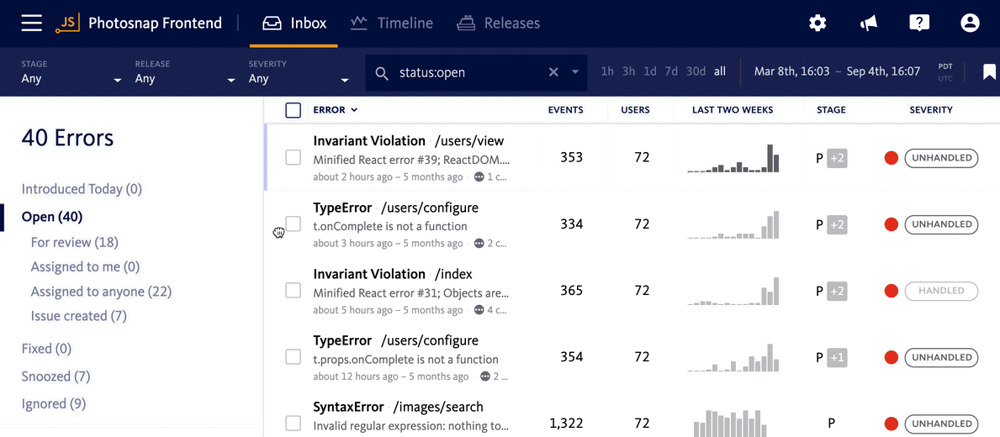

<!--suppress ALL -->


<h1  align="center">🦄</h1>
<h1  align="center">.yxorP Proxy Guzzler SAAS(y) </h1>
<h3 align="center"> Plug & Play [CURL + Composer *Optional], Proxy as a Service, Multi-tenant, Multi-Threaded, with Cache & Article Spinner.</h3>
<p align="center">$(yxorp)->proxy(🌈) [ 'aka', 'the guzzler']</p>
</p>

<h3 >🔋 Batteries are included</h3></h3>
<p  > Built-in Content Spinning and Auto Caching Engine, all housed within a stunning web GUI.</p>
<h3  >🚀 Cache Drivers Include</h3>
<p  >Arangodb, Devnull, Dynamodb (AWS),Cassandra, Devrandom,	Files, CouchBasev3, Memstatic, Firestore, Couchdb, Leveldb,	Mongodb, Memcache(d),Predis, Sqlite, Redis,	Wincache, Ssdb, Zend Disk Cache, Zend Memory Cache</p>

### .yxorP Proxy.

The strength of two of the most successful web proxy initiatives is combined in.yxorp. Vanilla Dashboard combines a
flat-file beautiful web interface with a custom multi-threaded caching layer and a powerful 10,000+ word thesaurus
article spinner to provide a zero-performance-loss robust self-service proxy engine that supports multiple tenants. The
project is looking for funding to help tie up some loose ends, particularly with the backed GUI; the front-end is
complete and functional, but requires some work on code cleanup and unit testing.

### Front-End

🚀 yxorp (proxy.) is a one-of-a-kind, plug-and-play (no installation necessary), multi-threaded, website mirroring and
content augmentation, fast cache, and multi-web proxy server (reverse proxy). The proxy is "modular" or "plugin-based,"
with an integrated "cache" management system and a web-based "cache" management system. Web-based reporting and
analytics interface (GUI) (GUI). The technology allows content to be "augmented" (or "spun") using a custom-built
content spinning engine with no performance degradation (10,000+ thesaurus/dictionary entries).


### Back-End

🍦 The Dashboard is a JavaScript-based user interface that communicates with a file-based database via PHP. Vanilla
Dashboard is a completely free and open source application. The Dashboard is a free and open-source project that
includes services such as Vanilla, "Live Chat," and "Who Is Online," as well as a number of "Easter Eggs" wrapped in a
CSS-based user interface.


<p align="center"></p>

## Use case / Applications

Setup .yxorp to Mirror your websites and server the mirros/clones as static flat file versions of your websites.

#### 🔥 Cache

Caching your websites will reduce loading time and server load, resulting in faster loading websites.

#### 📛 Firewall

Fire-wall your webistes behind your proxy wall, providing securiry against website attacks such as DDOS attacks and
more.

#### 🔳 iFrame

CORS-bypass for iframing services you need - **not recomended but possible**.

#### 🔱 Load-balancing

Load-balancing can be achived by running cloned versions of your website on multiple servers behind a load-balancer.

#### ⌛ Allways-online

Allways-online is possible by running a proxy of your exisiting website and switching to this version of the website
during updates or down-time.

##### + many more..

There are many applications, these are only a few that come to mind...


Error monitoring and application stability management solution via Bugsnag. Stability is the key to making data-driven
decisions on whether to build software or to fix bugs.



Recognized for best-in-class mobile support, our diagnostic data enables teams to reproduce and fix errors when they
start to impact stability. Error reports are grouped by root-cause, sortable by business impact, and displayed alongside
rich diagnostics.


<p align="center"></p>

## Instant Setup

Instant Development Enviroment stup with your prefered service provider:

[](https://vercel.com/new/clone?repository-url=https://github.com/4dboard/yxorP) [](https://www.heroku.com/deploy/?template=https://gitpod.io/#https://github.com/4dboard/yxorP) [](https://render.com/deploy?repo=https://github.com/4dboard/yxorP) [](https://gitpod.io/#https://github.com/4dboard/yxorP)


<p align="center"></p>

# Background Information

The project combines two of the most powerful PHP reverse proxies accessible on the internet to create a single web
proxy that outperforms them both. Bear in mind that this is a fledgling project that will be updated as needed. The
php-proxy library is used to create an installable and ready-to-use pre-beta web proxy application for your web server.
Contributing to/supporting this project will be greatly appreciated and will enable me to devote additional development
time to the project, hence expediting progress.


<p align="center"></p>


<p align="center"></p>

## Web-Proxy vs Proxy Server

Bear in mind that this proxy script may not work with websites/pages that are overly script-heavy or contain an
excessive number of "dynamic components." This is a well-documented disadvantage of web proxies. For such sites, you
should use a genuine proxy server to redirect your browser's HTTP requests through:


<p align="center"></p>

## Installation

It is critical to keep in mind that this is a **project** and not a library. It is not recommended to install this
package via * require*. This type of project should be immediately uploaded to your web server's public directory.

Download a pre-installed version of this application as a ZIP archive from the downloads area. [**
Releases**](https://github.com/4dboard/yxorP/releases/).


<p align="center"></p>

# The Dashboard

🍦 The Dashboard is a JavaScript dashboard that connects to a file-based database through PHP. Vanilla Dashboard is free
and open source software.

The Dashboard is a free and open-source project, and comes with Vanilla, "Live Chat," and "Who Is Online"
services baked in, as well as a variety of "Easter Eggs," all wrapped up in a CSS UI.


<p align="center"></p>

## Development Environment

You may either "plug and play" on PHP-compatible machines or build in a LAMP environment using the project's LAMP recipe
for Lando - A Liberating Dev Tool For All Your Projects, which can be found here. If you want to learn more about the
project, check out the FAQ. The use of local development and DevOps technologies by professional developers is
widespread around the globe, while it is most prominent in the United States. Release oneself from the mental
restrictions imposed by inadequate software for development. You may be able to save time, money, and frustration if you
concentrate your efforts on the most important tasks.


Clone this repo

```

git clone https://github.com/donPabloNow/vanilla-dashboard

```

Clone the "sample.env" to ".env" and update with the correct details.

```
cp ./sample.env ./.env
```

Host the files on a PHP server

```
# Start it up
lando start

# List information about this app.
lando info
```

or

```
# Initialize a lamp recipe using the latest codeigniter version
lando init \
  --source remote \
  --remote-url https://github.com/bcit-ci/CodeIgniter/archive/3.1.10.tar.gz \
  --remote-options="--strip-components 1" \
  --recipe lamp \
  --webroot . \
  --name my-first-lamp-app
```

For more information please see: https://docs.lando.dev/config/lamp.html


<p align="center"></p>

## Keep it up-to-date

The application itself will be modified infrequently; the majority of changes will be made to the application's
dependency packages, such as php-proxy.

#### .env

This file will be loaded into the Config class at the global level.

#### /plugins/

While PHP-Proxy includes a number of native plugins, users are encouraged to create their own custom plugins, which can
then be loaded automatically from this subdirectory. See /plugins/TestPlugin.php for an example.


<p align="center"></p>

# Gitpod

Gitpod is an open-source Kubernetes tool for quickly establishing code-ready development environments. It produces
fresh, automated development environments in the cloud for each work utilising cloud-based technologies. And it does all
of this in the cloud. It enables you to declare your development environment in code, as well as to launch immediate,
remote, and cloud-based development environments directly from your browser or desktop integrated development
environment.

https://gitpod.com/#https://github.com/donPabloNow/vanilla-dashboard


<p align="center"></p>

## Usage & How to Guide

Navigate to the root of the project with your browser, register an account and then login.


<p align="center"></p>

## Contributing to the Project

Pull requests are evaluated and approved by the development team. If you want to talk about the changes you want to
make, please create a new issue for that purpose. If possible, please ensure that tests are updated on a regular basis
in order to avoid misconceptions.


<p align="center"></p>


<p align="center"></p>

# Screenshots

<p align="center">


</p>


<p align="center"></p>

## Road Map

- [x] Front-end
    - [x] Combine Proxy Engines
    - [x] Allow Multi-tent rendering
    - [x] Build Caching Layer
    - [x] Develop Multi-threading support (PHP Vanilla/Independent)

    + More (To be listed soon)

- [x] Foundation
    - [x] API Service
    - [x] TxT DB
    - [x] Login
    - [x] Registration
    - [x] Dashboard
    - [x] Who is Online
    - [x] Documentation
- [ ] Tables
    - [x] Users
    - [x] Notes
    - [x] Tasks
    - [ ] Chat
- [ ] Notes
    - [x] Data Scheme
    - [x] API Endpoints
    - [x] Functions
    - [ ] UI
- [ ] Tasks
    - [x] Data Scheme
    - [x] API Endpoints
    - [x] Functions
    - [ ] UI
- [ ] Chat
    - [ ] Data Scheme
    - [x] API Endpoints
    - [x] Functions
    - [ ] UI
- [ ] Testing
    - [x] Versions
    - [x] Owners
    - [ ] Crate details


<p align="center"></p>

## Licensing

[MIT](https://choosealicense.com/licenses/mit/)


