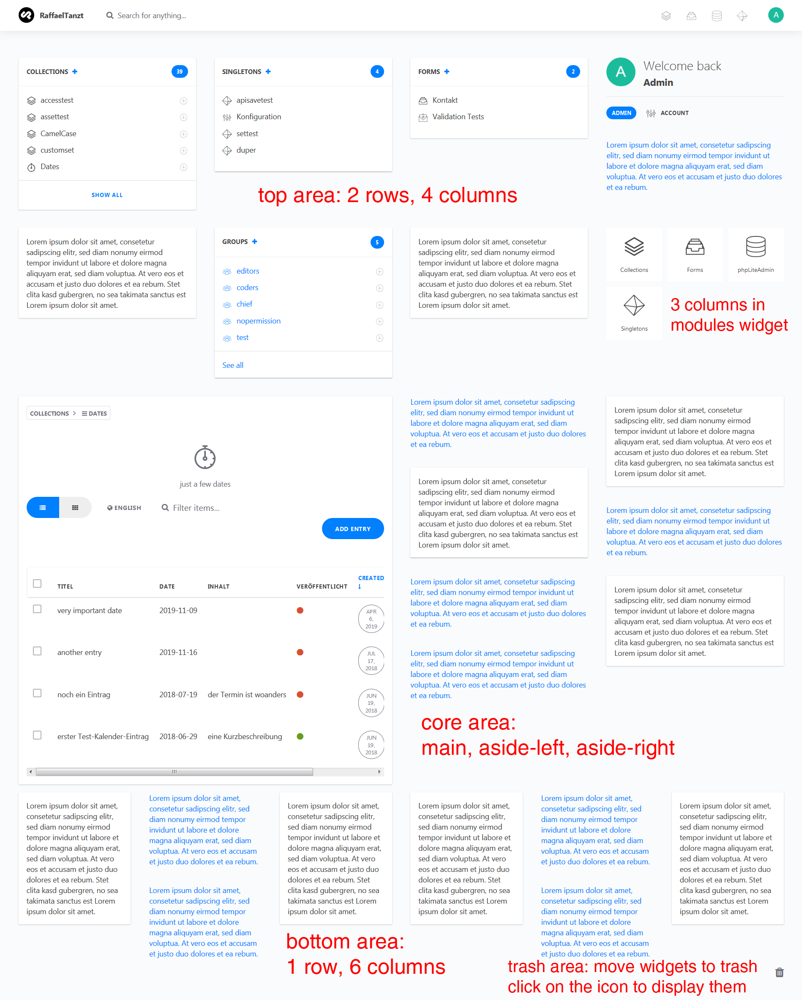

# DashboardGrid

Custom dashboard with grid for [Cockpit CMS][1]

This addon adds a top and a bottom area around the core dashboard widget areas. The number of columns and rows can be adjusted via config file.

**Important:** If you don't want to use this addon anymore, you have to move all widgets to one of the core areas before you remove it (or you have to delete the options in the `cockpit/options` table manually). Otherwise Cockpit will throw a fatal error, because it tries to call a function on a non-existent object in the dashboard function.

**Tip:** Zoom out before rearranging widgets.

## Installation

Copy this repository into `/addons` and name it `DashboardGrid` or

```bash
cd path/to/cockpit
git clone https://github.com/raffaelj/cockpit_DashboardGrid.git addons/DashboardGrid
```

## Configuration

Add these options to `cockpit/config/config.yaml`:

```yaml
dashboardgrid:
    top:
        rows: 2         # default: 1
        columns: 4      # default: 2
    bottom:
        rows: 1         # default: 1
        columns: 4      # default: 6
    widgets:
        modules:        # number of columns for modules widget
            columns: 3  # default: 2
```

## How to add custom areas

Besides changing the number of rows and columns, you can add your own areas. With the code below, an area with full width is added above the one, that was provided with this addon.

```php
$app->on('admin.init', function() {

    if (isset($this['modules']['dashboardgrid'])) {

        $this->on('admin.dashboardgrid.widgets.top', function($areas) {
            $area = 'my-custom-area';
            $this->renderView('path/to/custom/dashboard_area.php', compact('areas', 'area'));
        }, 90); // priority < 100: above, > 100: below addon top area with prio 100

    }

});
```

Content of `path/to/custom/dashboard_area.php`:

```php
<div class="uk-width-medium-1-1" data-area="{{ $area }}">
    <div class="uk-sortable uk-grid uk-grid-gutter uk-grid-width-1-1" data-uk-sortable="{group:'dashboard',animation:false,handleClass:'dashboard-handle'}">
      @if(isset($areas[$area]))
        @foreach($areas[$area] as $widget)
        <div data-widget="{{ $widget['name'] }}">
            <i class="dashboard-handle uk-icon-arrows"></i>
            {{ $widget['content'] }}
        </div>
        @endforeach
      @endif
    </div>
</div>
```

## Screenshot



[1]: https://github.com/agentejo/cockpit
